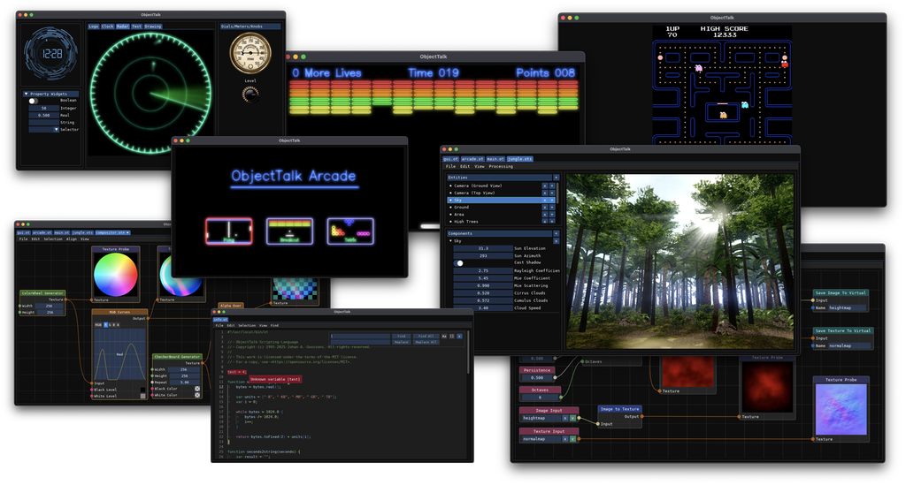

 

 

# ObjectTalk

Welcome to ObjectTalk, a object-oriented Swiss Army Knife providing a
Scripting Language, 2D/3D Graphics Engine, Node Based Programming,
an Entity Component System and an Integrated Development Environment
to learn and have some fun.

Late 2020, I retired after a 40+ year career in the software and
system development business. Starting as a programmer/analyst and later
moving up the ladder to management, international standardization
and geopolitics exposing my to lots of technologies including operating
systems, computer language development, web application design, military
command and control systems, data science and what we now call
artificial intelligence. You can read my full bio on
[my website](https://goossens.github.io).

After retirement, I dusted off some old projects to improve mental
health (applying the "use it or loss it" principle like we do for physical
health) and that's how this repository came about. I started by revisiting
a scripting language I wrote decades ago, modernizing it and learning
things along the way. Once the language was stable, it needed a few
use cases and I dusted off some 2D/3D graphic projects that I had laying
around. This then led to including graphics engine, an Entity Component System
(ECS), Node Based programming and a custom Integrated Development Environment (IDE).

So today, this project contains a lot of code, compiles into a single
executable with no runtime dependancies and is functional on MacOS, Linux
and Windows. It basically is a playground to learn and have fun.
Think of it as a educational jack of all trades, master of none.

## ObjectTalk Scripting Language

ObjectTalk is a simple object-oriented scripting language that has
evolved over decades and was heavily influenced by other languages.
As a long time IT professional, I've seen a lot of software development
with all its greatness and flaws. ObjectTalk represents what I think
is a well-balanced scripting language that is easy to learn and can make
even a novice look good quickly. If you are interested in how I got
to where we are today, please see the
[history](https://goossens.github.io/ObjectTalk/tour.html#history)
page for the story behind ObjectTalk.

Full documentation for ObjectTalk can be found in
[the manual](https://goossens.github.io/ObjectTalk/).

## ObjectTalk's Graphics Engine

ObjectTalk contains a pretty decent 2D/3D graphics engine that works
across multiple platforms providing system agnostic abstractions
for the higher level capabilities. At its core, the graphics engine
manages graphical resources (e.g. shaders, buffers, uniforms, textures
and other assets) and it is multithreaded. It also contains cross platform
libraries to implement a canvas, filters, generators, vector display,
font management, 2D/3D geometric primitives and 2D path manipulation.

Some of its capabilities are already exposed in the scripting language
and the examples folder shows how to use it to create simple GUIs,
run some games in a vintage vector display or implement a simple
version of Pac-Man.

## Node Based Programming

Many years ago, I developed a graphical node-based editor to configure
computer I/O systems complete with stream processing and protocol
conversion. This worked really well and it allowed none-programmers
to assist during development, maintenance and operations. Once I played
with Blender's nodes for geometry and shaders, I thought it was a good idea
to add nodes to ObjectTalk as well. Please keep in mind though the becoming
a Blender clone is not one of the ambitions.

Each node really feels like an object instance and drawing connections
between them is akin to visual programming. Today, in ObjectTalk, the
IDE has an node editor that allows you to setup nodes and connect them
into a graph. These graphs are automatically reevaluated when values
change. The examples folder contains image processing chains and nodes
are used in the scene examples to process images or create geometry.
ObjectTalk has over 50 nodes already and many will follow depending
on my needs.

## 3D Scenes through an Entity Component System

My older 3D graphics projects were always based on OpenGL as at the
time, it felt like a good cross-platform solution. Fast forwarding
a few years and we now have a number of graphics APIs like DirectX,
Vulkan and Metal with programmable shaders. So in the end I decided
that the graphics engine mentioned above will provide an abstraction
over these APIs (in fact, the graphics engine uses DirectX on Windows,
Vulkan on Linux and Metal on MacOS) and focus the 3D scene capability
at a higher level.

This is where the Entity Component System (ECS) comes in as an architectural
pattern that has already been used in games for many years. ObjectTalk's
IDE contains an ECS editor that allows you to define entities (objects in
the real world) and associate a variety of components with them that
themselves offer functionality.

The 3D scene ECS also has nodes and script components to make the whole
thing more dynamic. In the examples folder, you'll find automatically
spinning cubes and an earth rotating based on mouse movements. Both of these
a driven by script components. The jungle and island example use nodes
to procedurally create terrain and add asset instances.

To round it all out, modern engine features like deferred rendering,
particle systems and post processing with fog, FXAA, Bloom, God Rays,
Cascaded Shadow Maps and Tone Mapping are also available.

## Integrated Development Environment

To round it all out, the ObjectTalk executable comes with builtin development
environment that allows editing and execution of the ObjectTalk thingies:

* **ObjectTalk script editor**
** This editor provides a powerful syntax highlighting capability modeled after a subset Visual Studio Code.
** The editor has full undo capabilities and works with UTF-8 encoded unicode text.
** The editor can launch to ObjectTalk scripts and has a console for output and highlighting for errors
** A visual debugger is planned but not yet integrated.

* **Node editor**
** This editor allows the creation of node graphs.
** The editor has full undo capabilities.
** The editor automatically evaluates the graphs so it can be used for realtime visual programming (e.g. image processing).

* **Scene editor**
** This editor allows the creation and configuration of entities and components.
** Entities are stored in trees making it easy to create entity hierarchies.
** The editor has full undo capabilities.
** Scenes can be run directly form the IDE to ensures node and script components function properly.

* **Miscelanious editors**
** The IDE is also capable of editing pure text, JSON and Markdown files (with syntax highlighting).

## Building and Installing ObjectTalk

Instructions for building and installing ObjectTalk on various
platforms can be found in the
[installation manual](https://goossens.github.io/ObjectTalk/installation.html).
Currently, instructions are available for MacOS, Linux and Windows.

## Future

## Special Thanks

This project uses a lot of Open Source products without which it would have
been a lot harder to implement ObjectTalk. You can find a full list on the
[credits page](CREDITS.md).

## License

Copyright (c) 1993-2025 Johan A. Goossens. All rights reserved.

This work is licensed under the terms of the MIT license.
For a copy, see <https://opensource.org/licenses/MIT>.
