# ObjectTalk in EBNF

Below is a formal expression of the ObjectTalk scripting language in
Extended Backus–Naur Form (EBNF). You can read more about this notation
on [Wikipedia](https://en.wikipedia.org/wiki/Extended_Backus–Naur_form). The pretty diagrams were created using the
["RailRoad Diagram Generator"](https://www.bottlecaps.de/rr/ui) which
translates EBNF into HTML with pictures. This tool is highly recommended
for visualizing grammar.

# Module
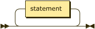

    module ::= statement*

# Statement
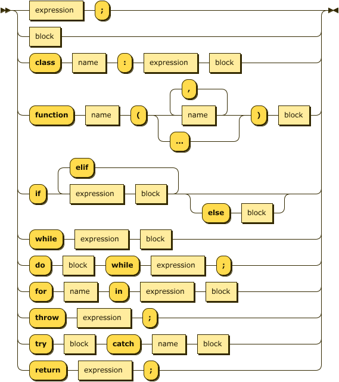

    statement ::= expression
    | block
    | "class" name ":" expression block
    | "class" name ":" expression block
    | "class" name ":" expression block
    | "function" name "(" (name ("," name)* | "...") ")" block
    | "if" expression block ("else" block)?
    | "while" expression block
    | "do" block "while" expression
    | "for" name "in" expression block
    | "switch" expression "{" ("case" expression statement)+ ("default" statement)? "}"
    | "return" expression

# Block
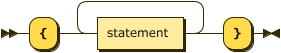

    block ::= "{" statement+ "}"

## expression
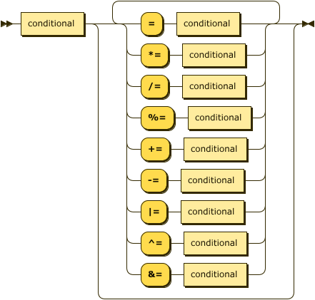

    expression ::= conditional ("=" conditional | "*=" conditional | "/=" conditional | "%=" conditional |
    "+=" conditional | "-=" conditional | "|=" conditional | "^=" conditional | "&=" conditional)*

# expressions

    expressions ::= expression ("," expression)*

## conditional

    conditional ::= or ("?" expression ":" expression)?

## or

    or ::= and ("||" and)*

## and
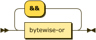

    and ::= bytewise-or ("&&" bytewise-or)*

## bytewise-or
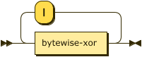

    bytewise-or ::= bytewise-xor ("|" bytewise-xor)*

## bytewise-xor

    bytewise-xor ::= bytewise-and ("^" bytewise-and)*

## bytewise-and
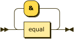

    bytewise-and ::= equal ("&" equal)*

## equal

    equal ::= relation ("==" relation  | "!=" relation)*

## relation

    relation ::= shift ("<" shift | "<=" shift | ">" shift | ">=" shift | "in" shift | "not in" shift)*

## shift

    shift ::= addition ("<<" addition | ">>" addition)*

## addition

    addition ::= multiplication ("+" multiplication | "-" multiplication)*

## multiplication

    multiplication ::= prefix ("*" prefix | "/" prefix | "%" prefix)*

## prefix
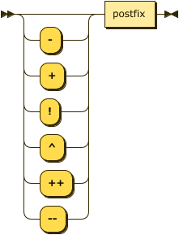

    prefix ::= ("-" | "!" | "^" | "++" | "--")? postfix

## postfix

    postfix ::= primary ("[" expression "]" | "(" expressions ")" | "." name | "++" | "--")*

## primary

    primary ::= "(" expression ")"
    | "[" expressions "]"
    | "{" string ":" expression ("," string ":" expression)* "}"
    | integer
    | real
    | string
    | function
    | name

## integer
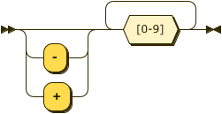

    integer ::= [-]? [0-9][0-9]*

## real
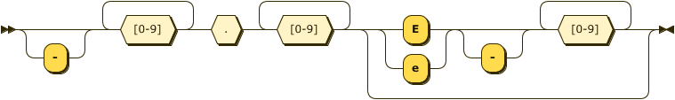

    real ::= [-]? [0-9][0-9]*.[0-9][0-9]* ([Ee] [-]? [0-9][0-9]*)?

## string
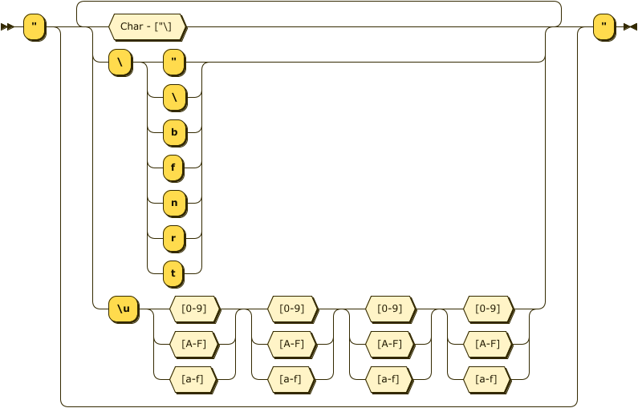

    string ::= '"' (Char - ["\] | '\' ["\bfnrt] | "\u"  [0-9A-Fa-f] [0-9A-Fa-f] [0-9A-Fa-f] [0-9A-Fa-f])* '"'

## function
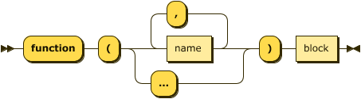
    function ::= "function" "(" (name ("," name)* | "...") ")" statement

## name

    name ::= [a-zA-Z_][a-zA-Z0-9_]*
